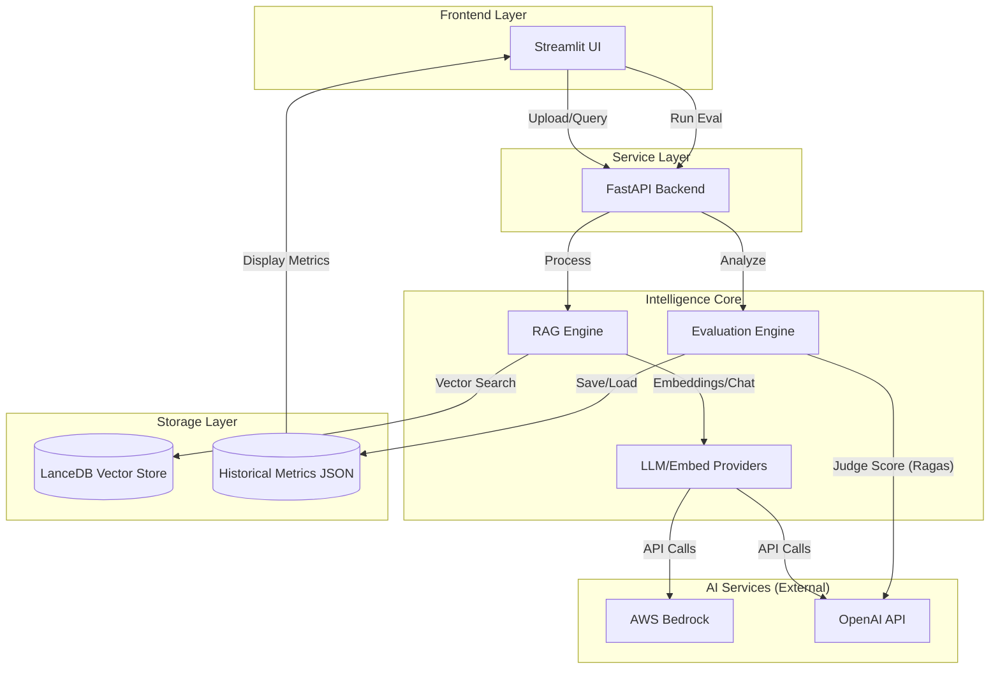
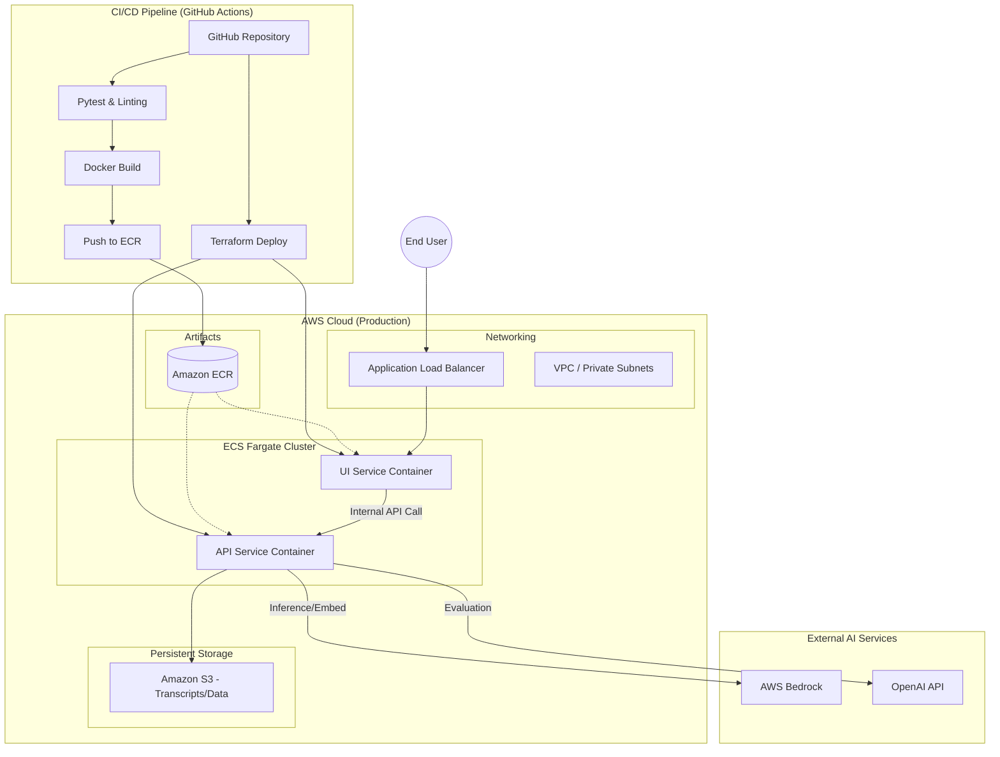

# Meeting Intelligence System

A modular, enterprise-grade system for analyzing meeting transcripts using RAG (Retrieval-Augmented Generation).

## 🏛️ Architecture Overview
This system follows a **Service-Oriented Architecture** (SOA) with a clean separation of concerns:

- **`ui_service` (Streamlit)**: Lean frontend for file uploads and interactive chat.
- **`api_service` (FastAPI)**: Orchestration layer that handles ingestion requests and queries.
- **`core_intelligence` (Internal Library)**: Framework-agnostic "Brain" containing the RAG engine, transcript parsers, and domain models.
- **`shared_utils`**: Cross-cutting concerns like configuration and logging.
- **LanceDB (Storage)**: A serverless, vector-native database that allows for metadata-aware filtering (e.g., searching by date/speaker) without the overhead of a managed server.

## � System Architecture Diagrams

### End-to-End Data Flow


**Key Flows:**
- **Ingestion**: Transcripts are uploaded via Streamlit → FastAPI processes and chunks them → Stored in LanceDB with metadata.
- **Retrieval**: User queries go through RAG Engine → Vector search retrieves relevant chunks → LLM synthesizes answer.
- **Evaluation**: Ragas evaluator judges response quality using LLM-as-a-judge → Metrics stored for dashboarding.

## �🚀 Quick Setup
1. **Prerequisites**: Python 3.11+, Poetry, and an OpenAI API Key.
2. **Install**: `poetry install`
3. **Configure**: Update `.env` with your `OPENAI_API_KEY`.
4. **Run via Docker**:
   ```bash
   docker-compose up --build
   ```
5. **Access**:
   - UI: `http://localhost:8501`
   - API: `http://localhost:8000`

## ☁️ Infrastructure as Code (AWS)
For production deployment, we have included a comprehensive Terraform suite in the `meet_intelli_system_iac/` folder.
- **Resources**: VPC, ECS (Fargate), S3 (LanceDB Storage), and IAM Roles.
- **Prefix**: All resources are prefixed with `meeting-intel` for organizational clarity.
- **S3-Native DB**: The system is designed to use S3 as the primary backend for the vector database, eliminating the need for a persistent server.

### Production AWS Architecture & CI/CD Pipeline


**Deployment Pipeline:**
- **CI/CD**: GitHub Actions automatically tests, builds Docker images, and pushes to Amazon ECR on every commit.
- **IaC**: Terraform provisions and manages all AWS resources (VPC, ECS, IAM, S3) with version control.
- **GitHub OIDC**: Securely authenticates with AWS without long-lived credentials.
- **Runtime**: End users connect through ALB → UI/API services scale independently on Fargate → Services call AWS Bedrock and OpenAI as needed.

## 🧠 Engineering Philosophy & Decisions

### 1. RAG/LLM Approach
- **LLM**: GPT-4o-mini (Cost-effective and excellent at reasoning over structured transcripts).
- **Embedding**: `text-embedding-3-small` (Optimized for retrieval tasks).
- **Vector Store**: **LanceDB**. Chosen for its "Serverless" nature. It stores data in a columnar format (Parquet-based), enabling SQL-like metadata filtering (e.g., "Find meetings between Jan and Feb") which FAISS cannot do natively.
- **Framework**: **LlamaIndex**. Used for its robust data connectors and advanced query engine capabilities.

### 2. Scalability & Productionization
To move to production on a hyper-scaler (AWS/GCP/Azure):
- **Storage**: Swap the local `./data` mount for **S3/Azure Blob Storage** (LanceDB natively supports S3).
- **Compute**: Deploy the services as independent containers on **ECS/EKS**.
- **Worker**: Introduce an asynchronous task queue (Celery + Redis) for heavy STT processing or large batch indexing.
- **Observability**: Integrate **OpenTelemetry** and structured JSON logging (already scaffolded in `shared_utils`).

### 3. Technical Decisions
- **Modularity**: The `core_intelligence` is a standalone package. This allows it to be reused in Lambda functions or CLI tools without dragging along the FastAPI/Streamlit dependencies.
- **Metadata-First Ingestion**: Transcripts are parsed into segments with speaker/timestamp metadata, allowing the LLM to provide context-aware answers (e.g., "Who said X?").
- **Clean Architecture**: Delivery mechanisms (API/UI) are decoupled from deep business logic (RAG/Parsing).

## 🛠️ AI Tool Usage
- Used for rapid scaffolding of boilerplate code (Pydantic models, Dockerfiles).
- Ensure code quality through manual reviews and architectural alignment.
- **Do's**: Use AI for unit test generation and regex patterns.
- **Don'ts**: Never let AI decide the macro-architecture; human-led design is essential for maintainability.

## 🔮 Future Enhancements
Level 1:
-  Github actions -- done
-  Latest RAG techniques (Corrective RAG, RAG Fusion) -- done
-  Display RAGAS metrics on the web. -- done
-  pluggable Gaurdrails, Retrival Strategies, Chunk Stratagies -- done 
Level 2:
-  use Langchain
-  Extend to PDF and docx (tool call and actions)
-  Integration of Whisper for direct voice-to-transcript analysis. 
-  Multi-modal support for meeting slide analysis.
-  Move to standalone database
-  Prompt memory in db, guard rails, options to config from strict to moderate to slim
-  Make the agentc design template.
