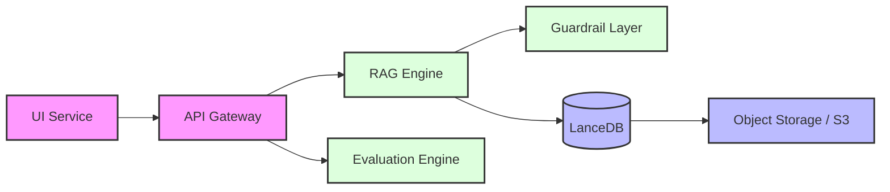
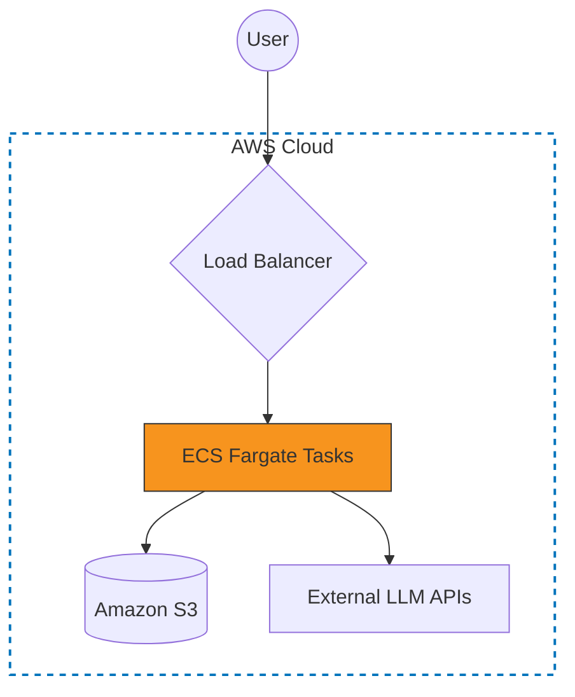

# Meeting Intelligence System

Modular system for processing and analyzing meeting transcripts using Retrieval-Augmented Generation (RAG). 
It is designed to be service-oriented, allows independent scaling of the ingestion and query layers.

## Getting Started

### Prerequisites
- Python 3.11+
- Poetry
- OpenAI API Key

### Local Installation
1. **Clone and Install**:
   ```bash
   poetry install
   ```
2. **Configuration**: Create a `.env` file in the root directory, example file provided:
   ```bash
   OPENAI_API_KEY=sk-...
   ```
3. **Run Services**:
   The simplest way to run the full stack is via Docker Compose:
   ```bash
   docker-compose up --build
   ```

**Service Endpoints**:
- Interactive UI (Streamlit): `http://localhost:8501`
- REST API (FastAPI): `http://localhost:8000/docs`

---

## Architectural Overview

The system architecture decouples the frontend delivery from the intelligence logic.

### System Data Flow


### Cloud Production Topology


---

## RAG & LLM Implementation Strategy

### Component Selection
- **LLM**: `gpt-4o-mini`. After testing several models, this provided the best latency-to-reasoning ratio for summarizing long-form meeting transcripts.
- **Embeddings**: `text-embedding-3-small`. Chosen for its 1536-dim performance and low cost per token.
- **Vector Store**: **LanceDB**. I selected LanceDB specifically for its serverless integration with S3. This avoids the overhead of managing a persistent vector database cluster while maintaining high performance via Parquet-based storage.
- **Orchestration**: **LlamaIndex**. Provides a cleaner abstraction for document management and complex retrieval pipelines compared to building from scratch.

### Avoiding Cloud Quotas (OpenAI vs. AWS Bedrock)
If you encounter AWS Service Quotas or Throttling in production, the system is designed to seamlessly switch to OpenAI. This is often the "easier" path for rapid scaling:
- Set `LLM_PROVIDER=openai` and `EMBED_PROVIDER=openai` in your `.env`.
- Ensure your `OPENAI_API_KEY` is set.
- The system will bypass Bedrock and use OpenAI's robust endpoints for both reasoning and semantic search.

### Retrieval Logic
- **Semantic Partitioning**: We moved away from fixed-token chunking to semantic-based breakpoints, ensuring speaker turns and topic shifts are preserved.
- **Hybrid Retrieval**: The engine performs a weighted combination of vector similarity and BM25 keyword matching to ensure specialized terminology in meetings (e.g., project names) isn't missed.
- **Post-hoc Reranking**: Retreived chunks are passed through a cross-encoder step to prioritize the most relevant context before LLM synthesis.
- **Guardrails**: A deterministic validation step checks for PII and ensures the LLM doesn't speculate outside the provided transcript context.

---

## Technical Decisions & Standards

### Key Decisions
1. **Internal Library Pattern**: The `core_intelligence` folder is structured as an internal package. This allows for total decoupling from the web frameworks (FastAPI/Streamlit). We could point a CLI tool or a Lambda function at this core without any modification.
2. **Schema Safety**: I implemented a `SchemaManager` that runs at startup. It verifies that the LanceDB table structure matches our Pydantic models, preventing runtime errors during ingestion.
3. **Stateless Operations**: The API is strictly stateless. All persistable state is pushed to LanceDB/S3, allowing the system to scale horizontally across multiple containers.

### Engineering Standards
- **Validation**: Strict Pydantic models for all data interchanged between services.
- **Logging**: Implemented `structlog` for JSON-standardized logs to facilitate debugging across multiple services in CloudWatch/Datadog.
- **Testing**: Focused on integration tests for the RAG pipeline using `Ragas` to measure faithfulness and relevancy.
- **Trade-offs**: I skipped implementing a full asynchronous task queue (like Celery) for the initial build to reduce deployment complexity, though it would be required for very high-volume ingestion.

---

## AI Tools & Development Retrospective

### Usage of AI Tools
I utilized AI (specifically LLMs) as a high-speed "pair programmer" for:
- Writing boilerplate Pydantic schemas and Docker configurations.
- Generating edge-case test data for the transcript parser.
- Debugging complex RegEx patterns for segmenting fragmented transcripts.

### Retrospective & Future Directions
With more time, I would focus on:
1. **Multi-Modal Integration**: Meetings often include shared screens. Ingesting slide content via OCR/Vision models would significantly improve answer quality for technical meetings.
2. **Knowledge Graph Expansion**: Moving from a flat vector store to a hybrid Vector+Graph approach would allow the system to track project and person relationships across years of meeting history.
3. **Audio-Native Processing**: Integrating Whisper directly at the ingestion layer to move from "Transcript Analysis" to "Meeting Analysis".

---
*Technical Handover Documentation - February 2026*


