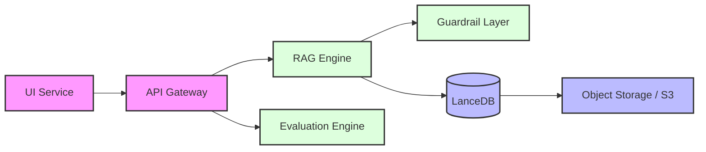
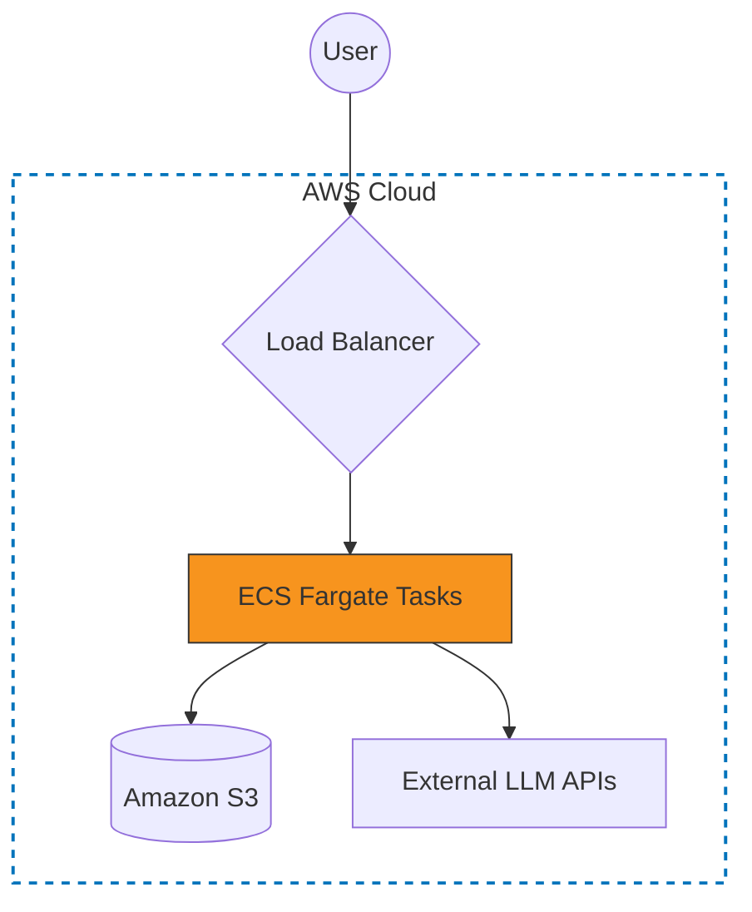

# Meeting Intelligence System

Modular system for processing and analyzing meeting transcripts using Retrieval-Augmented Generation (RAG). 
It is designed to be service-oriented, allows independent scaling of the ingestion and query layers.

## Getting Started

### Prerequisites
- **Docker & Docker Compose** (Primary)
- **OpenAI API Key** (Configured in `.env`)

### Quick Start (Recommended)
The simplest way to run the full stack is via Docker Compose, which handles all dependencies automatically:

1. **Configuration**: Create a `.env` file in the root directory:
   ```bash
   OPENAI_API_KEY=sk-...
   ```
2. **Run Services**:
    cd to ./meeting_intelligence_system
   docker-compose up --build
   ```
3. **Environment**: Ensure your `.env` is configured as described above.

**Service Endpoints**:
- Interactive UI (Streamlit): `http://localhost:8501`
- REST API (FastAPI): `http://localhost:8000/docs`


## Architectural Overview

The system architecture decouples the frontend delivery from the api logic.

### System Data Flow


### Cloud Production Topology


---

## RAG & LLM Implementation Strategy
The idea was to demonstrate an end-to-end enterprise scale application.
plug and switch components as we need.

### Component Selection
- **LLM**: `claude-3-haiku-20240307-v1:0`. I tried a few models on aws, none of them worked and for what we are doing, all models relatively perform well, got my quotas increased for claude, using that.

- **Embeddings**: picked amazon.titan-embed-text-v2:0, hit aws daily throtttling limit for personal users, moved to low cost per token openai.
- **Vector Store**: **LanceDB**. I selected LanceDB specifically for its serverless integration with S3. This avoids the overhead of managing a persistent vector database cluster while maintaining high performance via Parquet-based storage.
- **Orchestration**: **LlamaIndex**. Provides a cleaner abstraction for document management and retrieval pipelines compared to building from scratch.

### Avoiding Cloud Quotas (OpenAI vs. AWS Bedrock)
If you encounter AWS Service Quotas or Throttling in production, the system is designed to seamlessly switch to OpenAI.
- Ensure your `OPENAI_API_KEY` is set.
- The system will bypass Bedrock and use OpenAI's robust endpoints for both reasoning and semantic search.

### Retrieval and trials -- needs more time for optimisation and perfection.
The current architecture is the result of several failed experiments with "flashy" RAG techniques:

**Iteration 1: Naive Vector Search**: 
   -  Small chunks caused "Context Fragmentation." The LLM would see a speaker's answer but lose the original question asked 20 seconds prior.
   -      Moved to **Semantic Partitioning**, which chunks by topic change rather than token count.

**Iteration 2: RAG Fusion (RRF)**:
   -   Generating 4-5 query variations led to "Inference Bloat." It increased latency and triggered AWS/OpenAI rate limits, while often retrieving 
         redundant content.
   -    kept as a pluggable strategy in `core_intelligence.engine.strategies.retrieval`. needs more effort to make it better.

 ** Hybrid + Semantic Reranking**:
   - combination of vector similarity and keyword matching (on local filesystems) or high-k vector search (on S3).
   - the chunks are then fed into a LLM Reranker to get the top 5 most relevant context sections.

### Guardrails
I implemented a two-stage validation layer that acts as a gatekeeper for both inputs and outputs.
- **Input**: Blocks attempts or queries that try to move the discussion outside the scope.
- **Output**: A "Verify-Only" checks the LLM's final summary against the physical chunks retrieved from LanceDB. detects hallucination (like an action item that wasn't in the data), it automatically replaces the response with a "safe" version restricted only to documented facts. 
as usual the problem was there were no nodes being returned from the search.

---

## Technical Decisions & Standards

### Key Decisions
I prioritized a modular and pluggable architecture; most components are decoupled so it can be scaled or containerized as a standalone service if required. 

**Schema Safety**: `SchemaManager` that runs to verifiy that the LanceDB table structure matches our Pydantic models, preventing runtime errors.
3. **Stateless Operations**: strictly stateless services.

- **Validation**: Strict Pydantic models for all data interchanged between services.
- **Logging**: Implemented `structlog` for JSON-standardized logs to facilitate debugging across multiple services in CloudWatch/Datadog.
- **Testing**: Focused on integration tests for the RAG pipeline using `Ragas` to measure faithfulness and relevancy.
                                its currently not operational on s3 but works fine on local filesystem.


## AI Tools & Development : Co-Pilot pro(mostly Gemini and antropic) would be exajuration to say I wrote some part of it :) oversaw most of the code until end of day 1 and spent most of my day syesterday solving CI/CD issues and issues with DB and S3 to work on aws. Solved all the issues with integration.
                    
- **Trade-offs**: 
I skipped implementing a full asynchronous task queue (like Celery) for the initial build to reduce deployment complexity, though it would be required for very high-volume ingestion.
after the first batch of tests which i reviewed (RegEx patterns), integration tests were mainly for debugging.


### Retrospective & Future Directions
With more time, I would focus on:
1) Focus on response perfection with grounded templates to verify as guard rails - a few days to understand the context and formulate and test diff stratagies.
2) Resolve the issue with ragas and metric collection, almost on the verge of solving it.
3) Multi-Modal Integration and multi format and tool calling integration.
4) Knowledge Graph Expansion from a flat vector store to a hybrid Vector+Graph allowing the system to track across years of meeting history.
5) Prompt memory implimentation and prompt quota tracking
6). Audio-Native Processing
7) A template centrc applicaiton which can be quickly customised and deployed for any domain.

Whats needed to run it on Cloud Native Hyperscalers?
the entire working pipeline is being used in this project from dev to staging to production with Ci/CD in action, its a matter of time and swapping the economical choice to more efficient   


