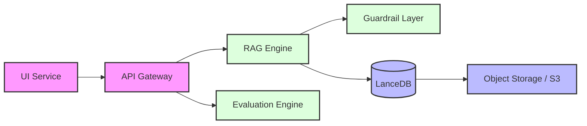
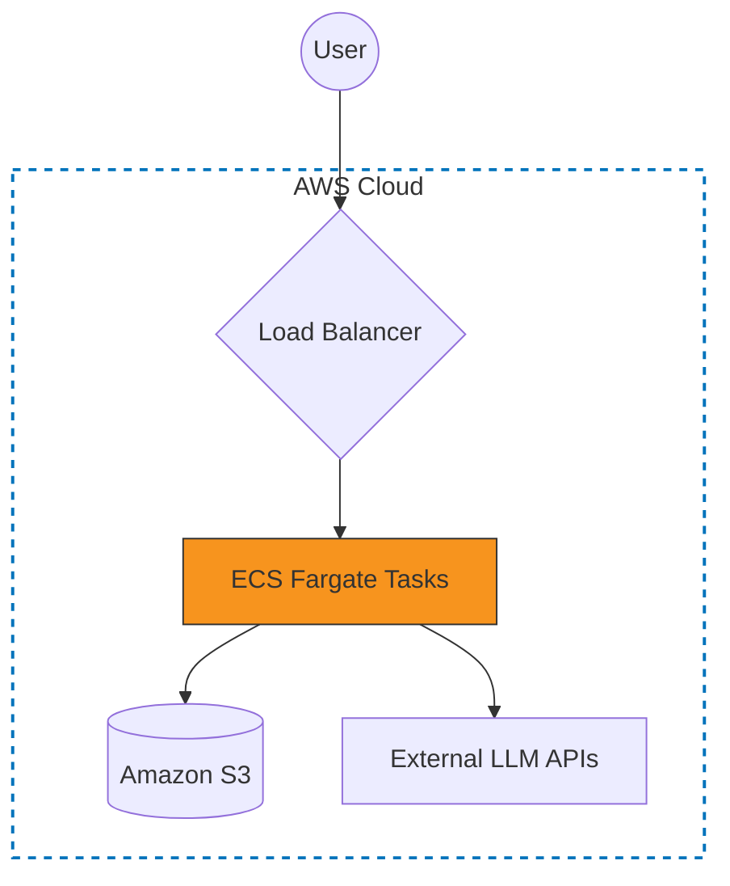

# Meeting Intelligence System

Modular system for processing and analyzing meeting transcripts using Retrieval-Augmented Generation (RAG). 
It is designed to be service-oriented, allows independent scaling of the ingestion and query layers.

## Getting Started

### Prerequisites
- **Docker & Docker Compose** (Primary)
- **OpenAI API Key** (Configured in `.env`)

### Quick Start (Recommended)
The simplest way to run the full stack is via Docker Compose, which handles all dependencies automatically:

1. **Configuration**: Create a `.env` file in the root directory:
   ```bash
   OPENAI_API_KEY=sk-...
   ```
2. **Run Services**:
    cd to ./meeting_intelligence_system
   docker-compose up --build
   ```
3. **Environment**: Ensure your `.env` is configured as described above.

**Service Endpoints**:
- Interactive UI (Streamlit): `http://localhost:8501`
- REST API (FastAPI): `http://localhost:8000/docs`


## Architectural Overview

The system architecture decouples the frontend delivery from the api logic.

### System Data Flow


### Cloud Production Topology


---

## RAG & LLM Implementation Strategy
The idea was to demonstrate an end-to-end enterprise scale application.
plug and switch components as we need.

### Component Selection
- **LLM**: `claude-3-haiku-20240307-v1:0`. I tried a few models on aws, none of them worked and for what we are doing, all models relatively perform well, got my quotas increased for claude, using that.

- **Embeddings**: picked amazon.titan-embed-text-v2:0, hit aws daily throtttling limit for personal users, moved to low cost per token openai.
- **Vector Store**: **LanceDB**. I selected LanceDB specifically for its serverless integration with S3. This avoids the overhead of managing a persistent vector database cluster while maintaining high performance via Parquet-based storage.
- **Orchestration**: **LlamaIndex**. Provides a cleaner abstraction for document management and retrieval pipelines compared to building from scratch.

### Avoiding Cloud Quotas (OpenAI vs. AWS Bedrock)
If you encounter AWS Service Quotas or Throttling in production, the system is designed to seamlessly switch to OpenAI.
- Ensure your `OPENAI_API_KEY` is set.
- The system will bypass Bedrock and use OpenAI's robust endpoints for both reasoning and semantic search.

### Retrieval and trials -- needs more time for optimisation and perfection.
The current architecture is the result of several failed experiments with "flashy" RAG techniques:

**Iteration 1: Naive Vector Search**: 
   -  Small chunks caused "Context Fragmentation." The LLM would see a speaker's answer but lose the original question asked 20 seconds prior.
   -      Moved to **Semantic Partitioning**, which chunks by topic change rather than token count.

**Iteration 2: RAG Fusion (RRF)**:
   -   Generating 4-5 query variations led to "Inference Bloat." It increased latency and triggered AWS/OpenAI rate limits, while often retrieving 
         redundant content.
   -    kept as a pluggable strategy in `core_intelligence.engine.strategies.retrieval`. needs more effort to make it better.

 **Iteration 3** Hybrid + Semantic Reranking**:
   - combination of vector similarity and keyword matching (on local filesystems) or high-k vector search (on S3).
   - the chunks are then fed into a LLM Reranker to get the top 5 most relevant context sections.

### Guardrails
I implemented a two-stage validation layer that acts as a gatekeeper for both inputs and outputs.
- **Input**: Blocks attempts or queries that try to move the discussion outside the scope.
- **Output**: A "Verify-Only" checks the LLM's final summary against the physical chunks retrieved from LanceDB. detects hallucination (like an action item that wasn't in the data), it automatically replaces the response with a "safe" version. 
as usual the problem is there are no nodes being returned from the search.

---

## Observability & Monitoring

system is production-ready and debuggable.

### 1. Structured Logging (`structlog`)
Instead of plain text logs, the system uses **Structured JSON Logging**.
- **Scoped Loggers**: Every component (API, RAG Engine, Parser) uses a scoped logger that automatically injects relevant context (e.g., `scope="api"`, `meeting_id="..."`).
- **Standardized Fields**: Logs include `func_name`, `elapsed_seconds`, and `result_type` for all decorated executions.
- **Cloud-Ready**: The JSON format is natively compatible with AWS CloudWatch and Datadog.

### 2. RAG Quality Monitoring (Ragas)
Continuous evaluation is built into the API via the `/api/evaluate` endpoint.
- **Metrics**: Tracks `Faithfulness` (hallucination detection), `Answer Relevancy`, and `Context Precision`.
- **Historical Analysis**: Results are persisted to `data/metrics/historical_metrics.json`, allowing us to track performance regressions over time as we update prompts or chunking strategies. ****currently only works on local env not in production.

### 3. Unified Observability Dashboard
The Streamlit UI includes a dedicated **Metrics Dashboard** that visualizes:
- **Historical Quality Trends**: Moving averages of Faithfulness and Relevancy scores.
- **Performance Latency**: Tracking of retrieval and generation times.
- **System Stats**: Document counts and indexing status.

---

## Technical Decisions & Standards

### Key Decisions
I prioritized a modular and pluggable architecture; most components are decoupled so it can be scaled or containerized as a standalone service if required. 

**Schema Safety**: `SchemaManager` that runs to verifiy that the LanceDB table structure matches our Pydantic models, preventing runtime errors.
3. **Stateless Operations**: strictly stateless services.

- **Validation**: Strict Pydantic models for all data interchanged between services.
- **Logging**: Implemented `structlog` for JSON-standardized logs to facilitate debugging across multiple services in CloudWatch/Datadog.
- **Testing**: Focused on integration tests for the RAG pipeline using `Ragas` to measure faithfulness and relevancy.
                                its currently not operational on s3 but works fine on local filesystem.


## AI-Assisted Development
The development of this system utilized a hybrid "Pilot/Navigator" approach. **GitHub Copilot (Gemini/Claude)** acted as a high-velocity pair programmer for scaffolding and boilerplate. This enabled me to focus on high-level architectural decisions, complex debugging of the LanceDB/S3 storage layer, and resolving CI/CD integration challenges on AWS.

---

### Retrospective & Future Directions
With more time, I would focus on:
1. **Response Grounding**: Enhancing guardrails with complex grounded templates to formally verify facts before they reach the user.
2. **Agentic Tool Use**: Expanding beyond flat retrieval to allow the system to call external tools (calendars, project trackers) based on meeting outcomes.
3. **Knowledge Graph Expansion**: Transitioning from a flat vector store to a hybrid Vector+Graph approach to track entity relationships across multi-year histories.
4. **Multi-Modal Ingestion**: Integrating Whisper directly to handle raw audio alongside text transcripts.
5. **Quota Management**: Implementing precise token usage and quota tracking per user/session.

### Cloud Native Implementation
The core pipeline is already cloud-ready with CI/CD and S3-backend LanceDB. The next phase involves scaling the ingestion via an async queue (SQS/Celery), tightening the evaluation guardrails for 99.9% groundedness, and potentially moving from OpenAI to high-throughput Bedrock models as quotas allow.

---
*Technical Handover Documentation - February 2026*


