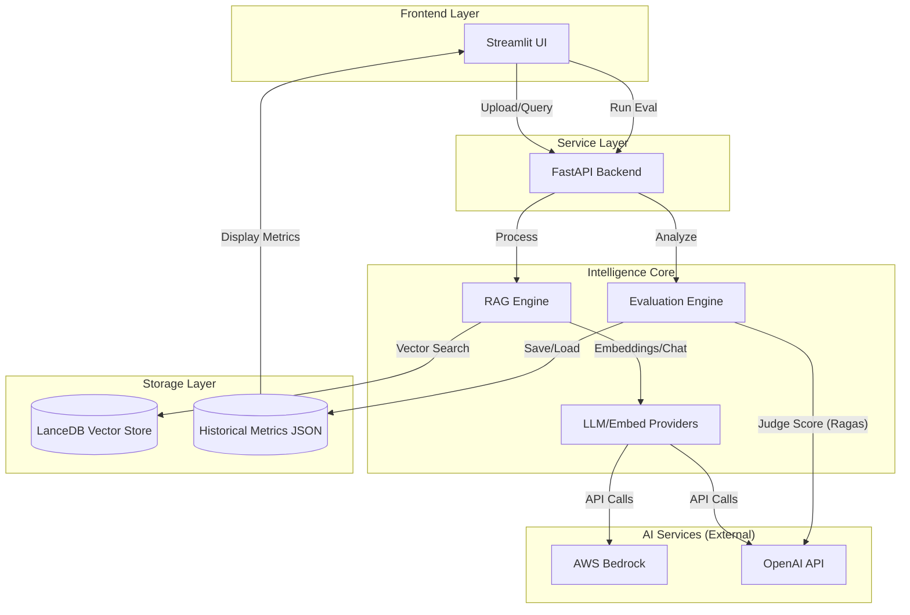
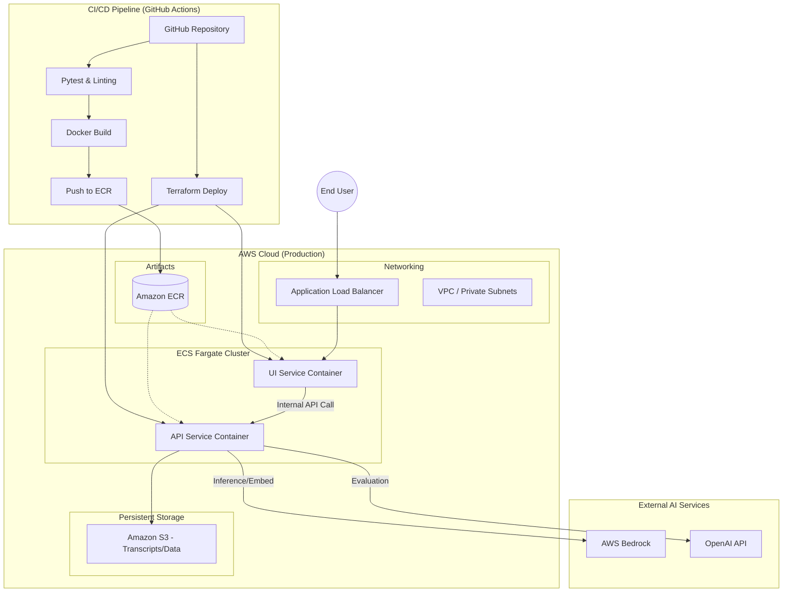

# Meeting Intelligence System

Modular system for processing and analyzing meeting transcripts using RAG. Service-oriented design standards allows independent scaling of ingestion and query layers.

## Getting Started

### Prerequisites
- Docker & Docker Compose
- OpenAI API Key

### Quick Start

1. Create a `.env` file in the project root:
   ```bash
   OPENAI_API_KEY=sk-...
   ```
2. Run:
   ```bash
   cd ./meeting_intelligence_system
   docker-compose up --build
   ```

Sample transcripts are in `meeting_transcripts_sample/`.

**Service Endpoints:**
- UI (Streamlit): `http://localhost:8501`
- API (FastAPI): `http://localhost:8000/docs`

---

## Architecture

### Data Flow

```mermaid
graph TD
    subgraph "Frontend Layer"
        UI[Streamlit UI]
    end

    subgraph "Service Layer"
        API[FastAPI Backend]
    end

    subgraph "Intelligence Core"
        RAG[RAG Engine]
        EV[Evaluation Engine]
        PR[LLM/Embed Providers]
    end

    subgraph "Storage Layer"
        LDB[(LanceDB Vector Store)]
        MET[(Historical Metrics JSON)]
    end

    subgraph "AI Services (External)"
        AWS[AWS Bedrock]
        OAI[OpenAI API]
    end

    UI -- "Upload/Query" --> API
    API -- "Process" --> RAG
    RAG -- "Vector Search" --> LDB
    RAG -- "Embeddings/Chat" --> PR
    PR -- "API Calls" --> AWS
    PR -- "API Calls" --> OAI
    UI -- "Run Eval" --> API
    API -- "Analyze" --> EV
    EV -- "Judge Score (Ragas)" --> OAI
    EV -- "Save/Load" --> MET
    MET -- "Display Metrics" --> UI
```

- **Ingestion**: Transcripts uploaded via Streamlit → FastAPI chunks them → stored in LanceDB with metadata.
- **Retrieval**: Query → RAG Engine → vector search → LLM synthesizes answer from relevant chunks.
- **Evaluation**: Ragas scores response quality (LLM-as-a-judge) → metrics persisted for dashboarding.

### Production AWS Architecture

```mermaid
graph TD
    subgraph "CI/CD Pipeline (GitHub Actions)"
        GH[GitHub Repository]
        TEST[Pytest & Linting]
        BUILD[Docker Build]
        PUSH[Push to ECR]
        TFRM[Terraform Deploy]
    end

    subgraph "AWS Cloud (Production)"
        subgraph "Artifacts"
            ECR[(Amazon ECR)]
        end

        subgraph "ECS Fargate Cluster"
            ECS_API[API Service Container]
            ECS_UI[UI Service Container]
        end

        subgraph "Networking"
            ALB[Application Load Balancer]
            VPC[VPC / Private Subnets]
        end

        subgraph "Persistent Storage"
            S3[Amazon S3 - Transcripts/Data]
        end
    end

    subgraph "External AI Services"
        BEDROCK[AWS Bedrock]
        OPENAI[OpenAI API]
    end

    GH --> TEST
    TEST --> BUILD
    BUILD --> PUSH
    PUSH --> ECR
    GH --> TFRM
    TFRM --> ECS_API
    TFRM --> ECS_UI
    ECR -.-> ECS_API
    ECR -.-> ECS_UI

    User((End User)) --> ALB
    ALB --> ECS_UI
    ECS_UI -- "Internal API Call" --> ECS_API
    ECS_API --> S3
    ECS_API -- "Inference/Embed" --> BEDROCK
    ECS_API -- "Evaluation" --> OPENAI
```

- **CI/CD**: GitHub Actions tests, builds Docker images, and pushes to ECR on each commit.
- **IaC**: Terraform manages all AWS resources (VPC, ECS, IAM, S3).
- **Auth**: GitHub OIDC — no long-lived credentials.
- **Runtime**: ALB → UI/API on Fargate → Bedrock/OpenAI.

---

## RAG & LLM Implementation

Components are pluggable — providers can be swapped without changing the pipeline.

### Component Selection
| Component | Choice | Notes |
|-----------|--------|-------|
| LLM | `claude-3-haiku` (Bedrock) | Falls back to OpenAI if Bedrock quotas are hit |
| Embeddings | OpenAI | Originally Titan v2; moved due to Bedrock throttling limits |
| Vector Store | LanceDB | Serverless S3 integration, Parquet-based storage |
| Orchestration | LlamaIndex | Document management and retrieval pipeline abstraction |

### Provider Fallback
If AWS Bedrock is throttled, the system falls back to OpenAI automatically. Ensure `OPENAI_API_KEY` is set.

### Retrieval Strategy Evolution

**Iteration 1 — Naive Vector Search:**
- Small chunks caused context fragmentation (lost conversational context between speakers).
- Moved to **Semantic Partitioning** — chunks by topic change rather than token count.

**Iteration 2 — RAG Fusion (RRF):**
- Multi-query generation increased latency and triggered rate limits with marginal retrieval improvement.
- Retained as a pluggable strategy in `core_intelligence.engine.strategies.retrieval`.

**Iteration 3 — Hybrid + Semantic Reranking (current):**
- Combines vector similarity with keyword matching (local) or high-k vector search (S3).
- LLM Reranker selects top 5 most relevant chunks.

### Guardrails
Two-stage validation on inputs and outputs:
- **Input**: Blocks off-topic or out-of-scope queries.
- **Output**: Verifies the LLM response against retrieved chunks. If hallucination is detected (e.g., fabricated action items), the response is replaced with a grounded version.

**Known issue**: Output guardrails can fail when vector search returns no nodes.

---

## Observability

### Structured Logging (`structlog`)
JSON-formatted logs with scoped loggers per component. Standard fields include `func_name`, `elapsed_seconds`, `result_type`. Compatible with CloudWatch and Datadog.

### RAG Quality Monitoring (Ragas)
Available via `/api/evaluate`. Tracks Faithfulness, Answer Relevancy, and Context Precision. Results persisted to `data/metrics/historical_metrics.json`.

**Note**: Evaluation currently works on local filesystem only, not on aws.

### Metrics Dashboard
Streamlit UI dashboard showing:
- Quality score trends (Faithfulness, Relevancy)
- Retrieval and generation latency
- Document counts and indexing status

---

## Technical Decisions

- **Modular architecture**: Components are decoupled and independently deployable.
- **Schema safety**: `SchemaManager` validates LanceDB table structure against Pydantic models at startup.
- **Stateless services**: No server-side session state.
- **Validation**: Pydantic models for all inter-service data exchange.
- **Logging**: `structlog` for structured JSON logs across all services.
- **Testing**: Integration tests for the RAG pipeline using Ragas (faithfulness/relevancy). Currently operational on local filesystem only.

---

## AI-Assisted Development
GitHub Copilot was used for  full code generation. Architectural decisions, LanceDB/S3 debugging, and CI/CD integration were done manually.

---

## Future Directions
1. **Response Grounding**: Grounded templates to verify facts before returning to the user.
2. **Agentic Tool Use**: Allow the system to call external tools (calendars, project trackers) based on meeting outcomes.
3. **Knowledge Graph**: Hybrid Vector+Graph store for entity relationships across meetings.
4. **Audio Ingestion**: Whisper integration for raw audio transcripts.
5. **Async Ingestion**: SQS/Celery queue for scaling transcript processing.
6. **Quota Management**: Per-user/session token tracking.

---


