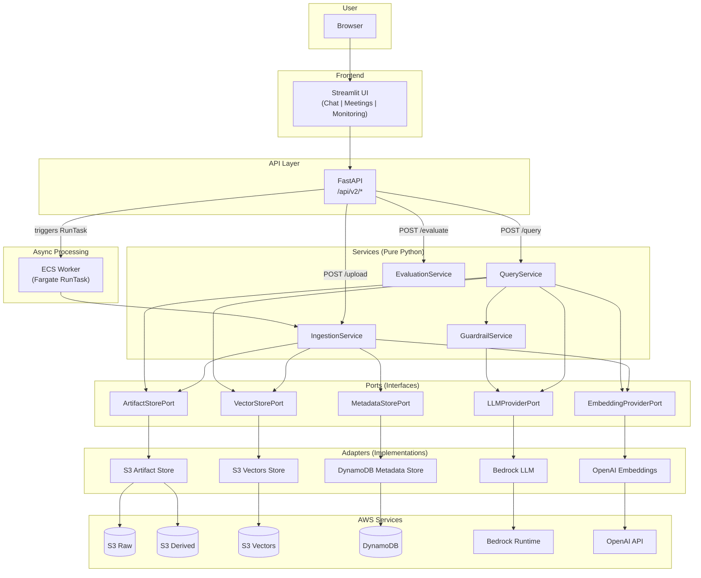
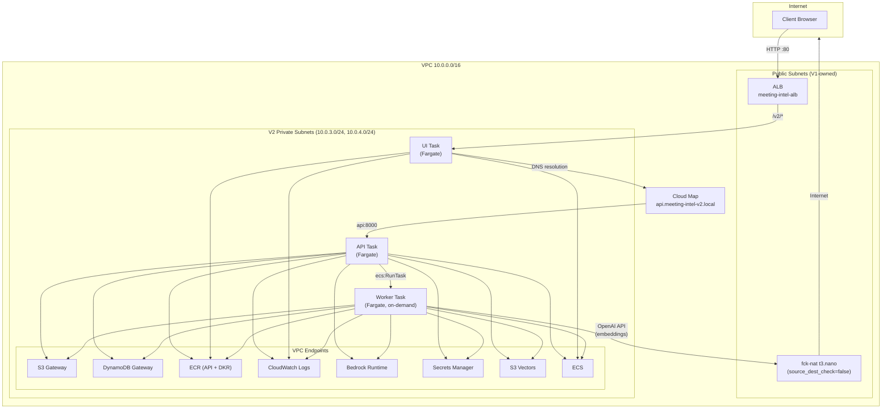
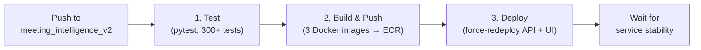

# Meeting Intelligence System V2 — Technical Review

## Table of Contents
- [Quick Setup](#quick-setup)
- [Why V2 — What Went Wrong with V1](#why-v2--what-went-wrong-with-v1)
- [Architecture Overview](#architecture-overview)
- [Productionization & Scaling](#productionization--scaling)
- [RAG/LLM Approach & Decisions](#ragllm-approach--decisions)
- [Key Technical Decisions](#key-technical-decisions)
- [Engineering Standards](#engineering-standards)
- [How I Used AI Tools](#how-i-used-ai-tools)
- [What I'd Do Differently](#what-id-do-differently)

---

## Quick Setup

### Local Development (Docker Compose)

```bash
# 1. Clone the repo and switch to the V2 branch
git clone https://github.com/sriram-ajay/meeting_intelligence_system.git
cd meeting_intelligence_system
git checkout meeting_intelligence_v2

# 2. Create a .env file
cat > .env << EOF
OPENAI_API_KEY=sk-your-key-here
LLM_PROVIDER=bedrock
EMBED_PROVIDER=openai
BEDROCK_REGION=eu-west-2
BEDROCK_LLM_MODEL_ID=anthropic.claude-3-haiku-20240307-v1:0
ENVIRONMENT=development
EOF

# 3. Run everything (API + UI + LocalStack for S3/DynamoDB)
docker-compose up --build

# 4. Open the UI
# Streamlit: http://localhost:8501
# API docs:  http://localhost:8000/docs
```

LocalStack emulates S3 and DynamoDB locally. The worker runs as an in-process thread locally— no ECS needed.

### Running Tests

```bash
poetry install --no-root
poetry run pytest tests/ -v -m "not integration and not rag_eval"
```

### AWS Deployment (already live)

Both V1 and V2 are live on the same ALB with path-based routing:

**V2 (this codebase):**
- UI: `http://meeting-intel-alb-63668379.eu-west-2.elb.amazonaws.com/v2/`
- API: private — accessible only via Cloud Map within the VPC

**V1 (original):**
- UI: `http://meeting-intel-alb-63668379.eu-west-2.elb.amazonaws.com/`
- API: `http://meeting-intel-alb-63668379.eu-west-2.elb.amazonaws.com/api/`

V2 infrastructure is managed via Terraform in `meet_intelli_system_iac_v2/`. 
CI/CD is handled by GitHub Actions (`.github/workflows/v2_deploy.yml`).

---

## Why V2 — What Went Wrong with V1

V1 was a working prototype, but had real problems:

- **Tight AWS coupling**: Services called boto3 directly — testing meant mocking AWS SDK deep inside business logic, fragile and slow
- **LanceDB didn't scale**: Great locally, but the S3 Parquet backend couldn't handle more than a few documents reliably and there's no managed offering
- **LlamaIndex abstraction**: Made debugging retrieval quality hard — couldn't tell if the problem was chunking, LlamaIndex internals, or the vector store
- **Over-engineered retrieval**: RAG Fusion generated 4–5 query variations per question, causing latency bloat and rate limiting. The final iteration added an LLM reranker on top. Multiple LLM calls per query, increasing cost and complexity
- **Synchronous ingestion**: Upload blocked the API until parsing, embedding, and storage completed
- **Evaluation broken in prod**: Ragas pipeline only worked on local filesystem, not against the deployed stack

V2 was a ground-up rewrite: ports-and-adapters for testability, S3 Vectors as a managed store, simpler sliding-window chunker, async worker for ingestion, and DeepEval running against the live deployment.

---

## Architecture Overview

### End-to-End System

The application has the following user-facing flows: 
-   Upload a transcript, 
-   Query it with natural language, 
-   Evaluate answer quality.


```mermaid
graph TD
    subgraph "User"
        Browser[Browser]
    end

    subgraph "Frontend"
        UI["Streamlit UI<br/>(Chat | Meetings | Monitoring)"]
    end

    subgraph "API Layer"
        API["FastAPI<br/>/api/v2/*"]
    end

    subgraph "Async Processing"
        Worker["ECS Worker<br/>(Fargate RunTask)"]
    end

    subgraph "Services (Pure Python)"
        IS[IngestionService]
        QS[QueryService]
        GS[GuardrailService]
        ES[EvaluationService]
    end

    subgraph "Ports (Interfaces)"
        AS[ArtifactStorePort]
        MS[MetadataStorePort]
        VS[VectorStorePort]
        LP[LLMProviderPort]
        EP[EmbeddingProviderPort]
    end

    subgraph "Adapters (Implementations)"
        S3A[S3 Artifact Store]
        DDB[DynamoDB Metadata Store]
        S3V[S3 Vectors Store]
        BED[Bedrock LLM]
        OAI[OpenAI Embeddings]
    end

    subgraph "AWS Services"
        S3_R[(S3 Raw)]
        S3_D[(S3 Derived)]
        S3Vec[(S3 Vectors)]
        Dynamo[(DynamoDB)]
        Bedrock[Bedrock Runtime]
        OpenAI[OpenAI API]
    end

    Browser --> UI
    UI --> API
    API -- "POST /upload" --> IS
    API -- "triggers RunTask" --> Worker
    Worker --> IS
    API -- "POST /query" --> QS
    QS --> GS
    API -- "POST /evaluate" --> ES

    IS --> AS & MS & VS & EP
    QS --> VS & EP & LP & AS
    GS --> LP

    AS --> S3A --> S3_R & S3_D
    MS --> DDB --> Dynamo
    VS --> S3V --> S3Vec
    LP --> BED --> Bedrock
    EP --> OAI --> OpenAI
```

**How a query flows through the system:**

1. User types a question in the Streamlit Chat tab
2. UI sends `POST /api/v2/query` with the question and optional meeting filter
3. QueryService embeds the question using OpenAI `text-embedding-3-small`
4. S3 Vectors returns the top-k most similar chunks (filtered by meeting_id if scoped)
5. QueryService downloads `chunk_map.json` from S3 Derived for citation metadata
6. A grounded prompt is assembled (context passages + question) and sent to Claude 3 Haiku via Bedrock
7. GuardrailService verifies the answer is actually supported by the retrieved context
8. A `CitedAnswer` is returned with the answer text, speaker/timestamp citations, and latency

### AWS Network Architecture


```mermaid
graph TB
    subgraph "Internet"
        Client[Client Browser]
    end

    subgraph "VPC 10.0.0.0/16"
        subgraph "Public Subnets (V1-owned)"
            ALB["ALB<br/>meeting-intel-alb"]
            NAT["fck-nat t3.nano<br/>(source_dest_check=false)"]
        end

        subgraph "V2 Private Subnets (10.0.3.0/24, 10.0.4.0/24)"
            API_T["API Task<br/>(Fargate)"]
            UI_T["UI Task<br/>(Fargate)"]
            Worker_T["Worker Task<br/>(Fargate, on-demand)"]

            subgraph "VPC Endpoints"
                VPCE_S3["S3 Gateway"]
                VPCE_DDB["DynamoDB Gateway"]
                VPCE_ECR["ECR (API + DKR)"]
                VPCE_CW["CloudWatch Logs"]
                VPCE_BR["Bedrock Runtime"]
                VPCE_SM["Secrets Manager"]
                VPCE_S3V["S3 Vectors"]
                VPCE_ECS["ECS"]
            end
        end

        CloudMap["Cloud Map<br/>api.meeting-intel-v2.local"]
    end

    Client -- "HTTP :80" --> ALB
    ALB -- "/v2/*" --> UI_T
    UI_T -- "DNS resolution" --> CloudMap
    CloudMap -- "api:8000" --> API_T
    API_T -- "ecs:RunTask" --> Worker_T

    API_T & Worker_T --> VPCE_S3 & VPCE_DDB & VPCE_S3V & VPCE_BR & VPCE_SM
    API_T & UI_T & Worker_T --> VPCE_ECR & VPCE_CW & VPCE_ECS

    Worker_T -- "OpenAI API<br/>(embeddings)" --> NAT
    NAT -- "Internet" --> Internet
```

**Why this layout matters:**

- V2 runs entirely in private subnets — no public IPs on any task
- The ALB only routes to the UI (`/v2/*`). The API has no listener rule — it's completely private, reachable only via Cloud Map from within the VPC
- VPC endpoints keep AWS-to-AWS traffic completely private
- The single NAT instance exists only because OpenAI's embedding API requires internet access — if we switched to Bedrock Titan for embeddings, we could remove it entirely
- Cloud Map provides private DNS so the UI resolves `api.meeting-intel-v2.local:8000` without touching the ALB

### CI/CD Pipeline


```mermaid
graph LR
    Push["Push to<br/>meeting_intelligence_v2"] --> Test["1. Test<br/>(pytest, 300+ tests)"]
    Test --> Build["2. Build & Push<br/>(3 Docker images → ECR)"]
    Build --> Deploy["3. Deploy<br/>(force-redeploy API + UI)"]
    Deploy --> Stable["Wait for<br/>service stability"]
```

Authentication uses GitHub OIDC — the V2 Terraform provisions a dedicated IAM role with trust for the repo. No static AWS keys stored in GitHub Secrets.

---

## Productionization & Scaling

The current deployment works for a demo, but there are real gaps before this is production-ready.

### What's already there
- **Infra-as-code**: Everything is in Terraform, including networking, so the whole stack is reproducible
- **Isolated environments**: V2 has its own state file, its own subnets, its own ECR repos — we can create staging/prod copies by changing the variables.
- **Structured logging**: All logs are JSON via structlog, shipped to CloudWatch. Every log line includes `scope`, `meeting_id`, and relevant context
- **Health checks**: ALB target groups have health check paths, ECS services have deployment circuit breakers

### What's missing for real production

**Scaling bottlenecks:**
- The API runs a single Fargate task. I'd add an ECS auto-scaling policy tied to ALB request count or CPU.
- The worker which ingests the document is a Fargate RunTask (one per upload), good for low throughput. For high volume we should switch to SQS + a worker service that polls the queue.
- S3 Vectors is brand new tech. scaling to 1000's of documents un-tested. For a production system, we need to run some benchmarks.

**Reliability:**
- If a worker dies mid-processing, the meeting stays in PENDING forever. A well designed messaging based architecture would give us automatic retries + DLQ and reliability.
- No multi-AZ for the NAT instance. In production, ideally will want to switch to Bedrock embedings or cloud native models rather than using NAT.
- No backup strategy for DynamoDB or S3. In production, need to set up lifecycle policies, backups, and a recovery plan.

**Security:**
- The ALB is HTTP-only. Production needs HTTPS with certificates and Route 53 for a proper domain.
- Ideally use cloudFront or similar cloud native service with inbuilt tools to protect from DDOS, SQL injection etc...
- The Streamlit UI has a hardcoded password. In production this should be behind Cognito or an IdP.
- I'm using Secrets Manager for the OpenAI key. But, the IAM policies could be tightened rather than fairly broad S3 and DynamoDB access).

**Observability:**
- Logs are there but I haven't set up CloudWatch alarms. For a production system without time tested metrics, wouldn't dare going live. alerts on: worker failures, API rate, query latency, ECS task restarts etc...
- DeepEval monitoring is integrated for answer quality to showcase RAG evaluation technique, runs on-demand from UI Monitoring tab. In production, this needs to be extended, run a percentage of queries automatically and push metrics to CloudWatch Metrics for dashboarding.
- No distributed tracing (X-Ray). Would add request IDs that flow end to end.

**Multi-region / hyper-scaler portability:**
- The architecture is cloud-native but AWS-specific (S3 Vectors, Bedrock, DynamoDB, ECS).
- Ports-and-adapters pattern were designed for this — we can write new adapters for GCP/Azure without touching the business logic

---

## RAG/LLM Approach & Decisions

### LLM Choice: Claude 3 Haiku via Bedrock

Considered three options: to be honest for the project in hand and the timeframe, most models are well capable of doing the job.
- **Claude 3 Haiku via Bedrock**: Fast, cheap and accessible via VPC endpoint (no internet), good at following grounding instructions.
- **Higher Claude Models**: Better quality but cost multiplies exponentially.
- **GPT-4o-mini via OpenAI**: Good quality, but adds another external dependency and egress cost

I went with Haiku because the answers for meeting transcript analysis don't need frontier-model reasoning — they need fast, faithful extraction from the provided context. Haiku does that reliably at <2s latency and to be honest one other reason was, only Anthropic LLM are accessible from my account and this was an easy option.

### Embedding Choice: OpenAI text-embedding-3-small

This was a pragmatic decision with again a story behind it:
- I started with **Bedrock Titan Embed V2** (1024 dimensions) to keep everything inside the VPC
- My AWS account had Titan V2 restricted, had to switch to **OpenAI text-embedding-3-small**
- This wwas the only reason why NAT instance for outbound internet, or else the entire stack would run completely private.

Embedding quality is comparable. OpenAI's model is slightly better on benchmarks but for meeting transcripts with explicit speaker and timestamp markers, either works fine.

### Vector Store: S3 Vectors

I evaluated:
- **LanceDB (V1)**: Embedded, serverless, zero-config. Great for local dev. But no managed AWS offering, and the file-based approach didnt scale past a few documents
- **OpenSearch Serverless**: Full-featured but expensive and heavy for this use case
- **pgvector on RDS**: Solid option, but adds a running database to manage
- **S3 Vectors**: New AWS service, fully serverless, pay-per-request, supports metadata filtering. Felt like the right bet for a cost-sensitive workload and cloud native.

S3 Vectors issues — metadata handling wasn't well-documented meaning the agent could not figure this out (`returnMetadata=True` and metadata_configuration used in terraform), and the Terraform provider is still very new. It will be the top contender for my future projects if it evaluates well for cross-document search and query latency under load.

### Chunking Strategy: Sliding Window

V1 went through three iterations before I settled on the V2 approach:

1. **Naive vector search with small chunks** caused "Context Fragmentation" — the LLM would see a speaker's answer but lose the question asked 20 seconds earlier. Important context was split across chunks.
2. **RAG Fusion (multi-query expansion)** generated 4–5 query variations to improve recall. In practice it caused latency bloat and triggered rate limits on both AWS and OpenAI, while mostly retrieving redundant content.
3. **Semantic Partitioning + LLM Reranker** chunked by topic change and used an LLM to rerank the top 5. It worked, but was complex and the reranker added an extra LLM call per query.

V2 dropped all of that for a simpler approach.

V2 uses a **sliding-window chunker** (512 tokens, 1 segment overlap). Each parsed segment is a structured object (timestamp, speaker, text) — the chunker groups segments until hitting the token limit, then reconstructs the `[HH:MM:SS] Speaker: text` format per chunk. A segment is never split, so the structure is always intact. Adjacent chunks share 1 trailing segment for context continuity.

Edge cases: the 512-token limit is a soft cap. If a single segments exceed (say, a long uninterrupted speech), it becomes one oversized chunk. For typical meetings this is ok.

### Prompt & Context Management

V1's `generate_with_context` used a generic prompt — `"Based on the following context, answer the question"` — with no grounding constraint. The LLM would sometimes pull in knowledge from its training data rather than sticking to the retrieved passages.

V2's query prompt is deliberately minimal but grounded:

"You are a meeting intelligence assistant. Answer the user's question using ONLY the context passages below. If the answer is not in the context, say so explicitly."

The key addition is the "ONLY" constraint and the explicit fallback instruction. I found that overcomplicating the prompt (adding persona details, format instructions, chain-of-thought requests) actually degraded the quality for this task. The simpler the instruction, the less likely it hallucinates.

### Guardrails

Two-layer approach, both using the LLM itself:

1. **Input validation**: A simple SAFE/UNSAFE classification prompt. Catches jailbreak attempts and off-topic queries. Runs before any retrieval.
2. **Grounding verification**: After the LLM generates an answer, a separate prompt checks whether the answer is actually supported by the retrieved context. If not, it generates a corrected "safe response" that only uses the provided passages.

Both guardrails **fail-open** — if the LLM call fails for any reason, the query proceeds normally. This was a deliberate choice: A future improvement would be 1–2 retries with short exponential backoff before falling open — this catches transient blips without adding meaningful latency.

### Quality & Observability

DeepEval is integrated for two metrics:
- **Faithfulness**: Is the answer actually supported by the retrieved context? (catches hallucination)
- **Answer Relevancy**: Does the answer actually address the question? (catches off-topic responses)

V1 used Ragas with three metrics (Faithfulness, Answer Relevancy, Context Precision). V2 switched to DeepEval because it integrates more cleanly as a Python library and I dropped Context Precision — with the simpler chunking strategy, precision is less of a concern than faithfulness.

These run on-demand from the Monitoring tab. In a production setup, I will sample queries 5-10% to automatically track the scores over time.

---

## Key Technical Decisions

### Ports & Adapters (Hexagonal Architecture)

This was the most impactful decision in the V2 rewrite. V1 had services calling boto3 directly, which made testing painful and tied business logic to AWS.

V2 has a strict layering:
- **Domain models** — pure Pydantic, no AWS imports
- **Ports** — Python Protocol classes defining contracts (`VectorStorePort`, `ArtifactStorePort`, etc.)
- **Adapters** — concrete implementations that talk to AWS (or in-memory for tests/local)
- **Services** — business logic that depends only on ports, never on adapters directly
- **DI Container** — wires everything together at startup

This makes testing fast — I can swap in mocks at the port boundary. It also made the S3 Vectors migration straightforward: In dev, used an  `InMemoryVectorStoreAdapter` for local/CI, and an `S3VectorsVectorStoreAdapter` for production. The services never changed.

### Async Upload + Synchronous Worker

Uploads return immediately with a `202 Accepted` and a `meeting_id`. The actual ingestion (parse, chunk, embed, store) runs asynchronously:
- In production: an ECS Fargate task launched via `RunTask`
- In local dev: a daemon thread inside the API process

I chose RunTask over SQS+worker-service because it's simpler to reason about — one task per upload, isolated, auto-cleaned. The tradeoff is cold-start latency (~20-30s for Fargate to pull the image), but that's acceptable since ingestion is a background operation anyway.

### V1/V2 Coexistence via Path-Based Routing

This came from a hard constraint: "don't break V1." The solution was path-based routing on a shared ALB:
- V1 routes: `/api/*`, `/`
- V2 routes: `/api/v2/*`, `/v2/*`

V2 has its own ECS cluster, ECR repos, DynamoDB table, S3 buckets, and Terraform state file. The only shared resources are the VPC and the ALB. This means I can iterate on V2 without any risk to the running V1. 
---

## Engineering Standards

### What I followed

- **Structured logging everywhere**: All components use structlog with JSON output. Every log includes a scope (e.g., `ingestion`, `query_service`, `worker`) and relevant context IDs. This makes CloudWatch Insights queries straightforward.

- **Comprehensive test coverage**: 302+ tests covering domain models, adapters (mocked boto3), services (all ports mocked), API endpoints (FastAPI TestClient), worker entrypoint, DI container, config loader, logging utilities, and constants. Tests run in CI on every push.

- **Type hints throughout**: Every function has type annotations. The port interfaces use `Protocol` with `@runtime_checkable` so you can verify adapter compliance with `isinstance()`.

- **Error hierarchy**: A structured exception hierarchy (`AppException` → `ValidationError`, `IngestionError`, `QueryError`, `ExternalServiceError`) with error codes, HTTP status mapping, and `to_dict()` serialization. Every adapter wraps boto3 exceptions into typed errors.

- **Infrastructure as code**: 13 Terraform files covering networking, storage, compute, IAM, and CI/CD. Everything is parameterized via variables so you could create a staging environment by changing `project_name`.

- **Dependency injection**: Singleton DI container with lazy initialization. Makes it easy to test services in isolation and swap adapters for different environments.

### What I skipped or cut corners on

- **No API versioning middleware**: V2 is just a path prefix (`/api/v2/`), not proper version negotiation
- **No database migrations**: DynamoDB is schemaless, no migrations needed. S3 Vectors a bir trickier — the `metadata_configuration` is set at index creation and is immutable, so any metadata schema change means destroying and recreating the index (and re-embedding all documents)
- **No load testing**: I verified the E2E flow works but haven't profiled under concurrent load. The embedding call is a bottleneck.
- **No integration tests in CI**: The pytest suite mocks all AWS calls. I did E2E testing manually against the live deployment, but there's no automated integration test that spins up LocalStack
- **Ruff/mypy not enforced in CI**: The linting tools are configured in pyproject.toml but the CI pipeline doesn't fail on lint warnings. can  add that as a gate.
- **No retry logic on adapter calls**: If an S3 `PutObject` fails, it fails. Production adapters should have exponential backoff with jitter.
- **No LangGraph**: original V2 design spec, I  planned to introduce LangGraph for orchestration, but the actual flow is linear (embed → retrieve → prompt → verify) so plain Python service calls were sufficient. Adding a graph framework for a straight-line pipeline would have been complex.

---

## How I Used AI Tools

I used GitHub Copilot (Claude) extensively throughout this project — it was my primary development partner for the V2 rewrite.

**Where it was most useful:**
- **Terraform authoring**: Writing IaC files from scratch would have been painful. Copilot generated the initial structure, I reviewed and adjusted. It got VPC endpoints, security groups, and IAM policies mostly right on first pass, though it needed corrections on some newer resources like S3 Vectors
- **Debugging AWS deployment issues**: very helpful with debugging aws network issues across multiple layers of private links, security groups, NAT, Internet Gateway. 
 **Test generation**, **adapters**.
On a funny note, in the old days, we are talking about 200 meetings with networks team and about 100 with operations and development team to build and get through the end to end provisioning with Ci/Cd :)

**Where I had to override it:**
- **Prompt engineering**: I tried the prompts Copilot suggested and then simplified them. The AI tends to make prompts verbose — for this use case, shorter was better

**My workflow:**
I treated Copilot as a very fast engineer who needs code review. I'd describe the architecture or the problem, let it generate a solution, review it carefully, and adjust. For infrastructure especially, I verified every Terraform resource against AWS docs before applying. The overall architecture decision and planning, solving issues whereever it got stuck (terraform, s3 vectorrs, debugging connection issues after deployment, metadata problem) was me — the implementation speed, hands down was completely Copilot's contribution.

---

## What I'd Do Differently

**With more time, the first three things I'd tackle:**

1. **SQS-based ingestion pipeline**: Replace the RunTask-per-upload model with an SQS queue and a long-running worker service. You get retries, DLQ for poison messages, batching, and much better visibility into backlog. The RunTask approach works but has cold-start latency and no built-in retry.

2. **Switch embeddings to Bedrock Titan**: Once my account access is approved, I'd move to Bedrock Titan V2 embeddings. This eliminates the NAT instance entirely — the whole stack would run without any internet access, which is both cheaper and more secure. The vector dimension changes from 1536 to 1024, which means recreating the index, but that's a one-time operation.

3. **Automated integration tests with LocalStack**: The Docker Compose already has LocalStack. I'd add a CI job that runs `docker-compose up`, uploads a transcript, waits for READY, queries it, and verifies citations. Right now this testing is manual, which is obviously not sustainable.
4. **Multi-environment promotion pipeline**: Set up separate dev/staging/prod stacks using Terraform workspaces or per-environment state files, with ephemeral dev environments that tear down after use. The Terraform is already parameterised — it's mostly a matter of wiring the CI/CD to promote through environments with approval gates
6. **Operational Dashboad setup**
7. **Spend more time planning the initial setup or Given the speed of development and deployment spend more time on rapid iterations before settling on a final stack**

**Beyond that:**
- Proper HTTPS with ACM + Route 53
- CloudWatch alarms for error rates and latency
- Request tracing with X-Ray or OTEL
- Auto-scaling policies for the API service
- Admin dashboard showing ingestion stats and query patterns
- Speaker diarization as a preprocessing step (the parser currently relies on the transcript already having speaker labels)
- Multi-modal ingestion — integrate Whisper to handle raw audio alongside text transcripts
- Agentic tool use — let the system call external tools (calendars, project trackers) based on meeting action items